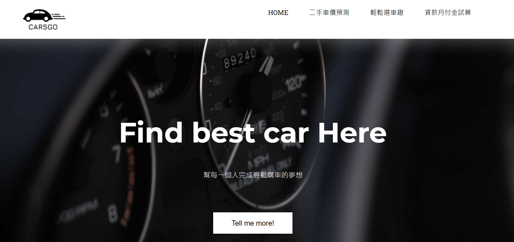

  

<h3 align="center">Carsgo好車購</h3>

  幫每一個人完成輕鬆購車的夢想!
   
  <a href="http://34.80.17.77/"><strong>Explore Our Website</strong></a>
   

  

### 專題構思: 解決購車者及貸款業者痛點

**購車者痛點**
- 二手買家面對市面上75,000台以上二手車難以挑選
- 不知道自己現有車子價值
- 懶得計算貸款月付金
**貸款業者痛點**
- 貸款業者獲客成本高-取得一客戶平均成本約為10,000元

### 專案目標

**購車者**
- 易找到理想中的車子 
- 能快速評估是否要換車
**貸款業者**
- 易找到貸款客群
- 獲客成本降低

### 功能概述

**AI x 二手車價格預測**
- 價格預測機器學習模型
- HADOOP叢集建置
**輕鬆選車趣**
- 爬蟲技術串接8大二手車網站資料
**貸款每月月付金試算**
- 8大銀行貸款資料串接
- 每月月付金式算

